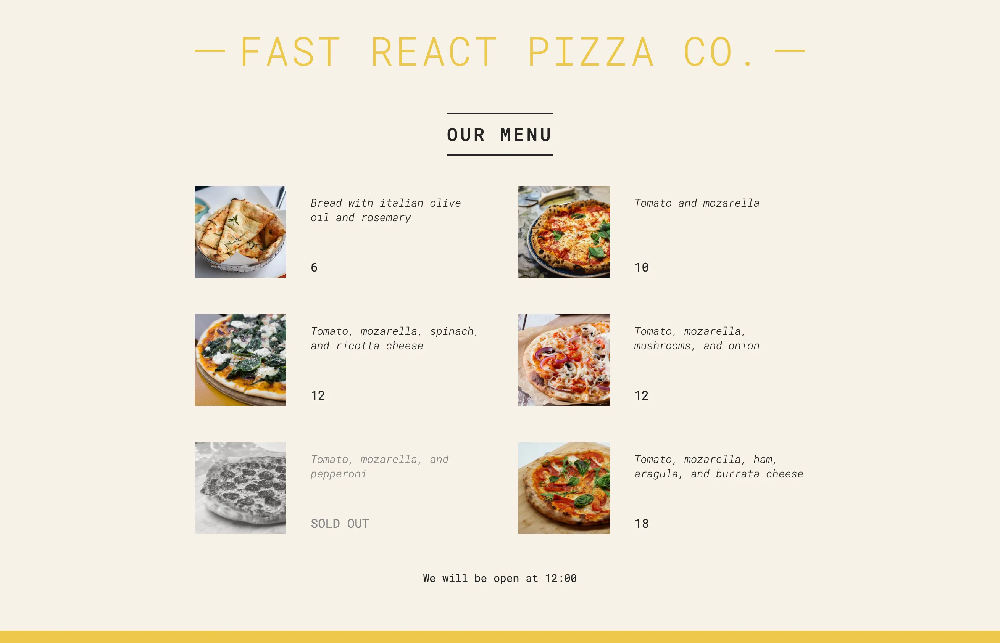

# React.js

React is a JavaScript framework/library that boost developmen productivity x2. It all about component (resuable) that can be used in different projects. Now this repository is all about my React development journey. Wish me luck 💪🏽💯.

> [!Note]  
> I am learning react with Jonas Schmedtmann React course on Udemy. All projects are designed by him.

---

| Projects ⚛️ | Difficulty Level 📊 | Progress 📈  |
| :---------: | :-----------------: | :----------: |
| Pizza-Menu  |     Beginner 🏃🏽‍♂️     | ✅ Completed |
|    Steps    |     Beginner 🏃🏽‍♂️     | ✅ Completed |
| Travel-list |     Beginner 🏃🏽‍♂️     | ✅ Completed |
| Eat-N-Split |     Beginner 🏃🏽‍♂️     | ✅ Completed |

---

### So what is React❓:

React is **component based**, meaning is all about putting a collection components (like a pricing card, navigation, carousel etc.) together to form a complex user interface. It's putting a puzzle together to reveal the whole picture. Components are reusable. React is **declarative.** This means we tell React what to do. This is possible using JXS. JSX combines HTML, CSS, JavaScript. Since react update the UI keeping in sync with the data, react is **State-driven** (data). React is actually just a library not a framework. React as a "framework" is very popular amongst developers. Big company use react in their web applications, followed by smaller or start up company. It has a vibrant and densed community. Plus, it is created by Facebook/Meta to provide more structure to it's code and allow it to scale much better.

##### Pizza Menu project 👇🏾

---
