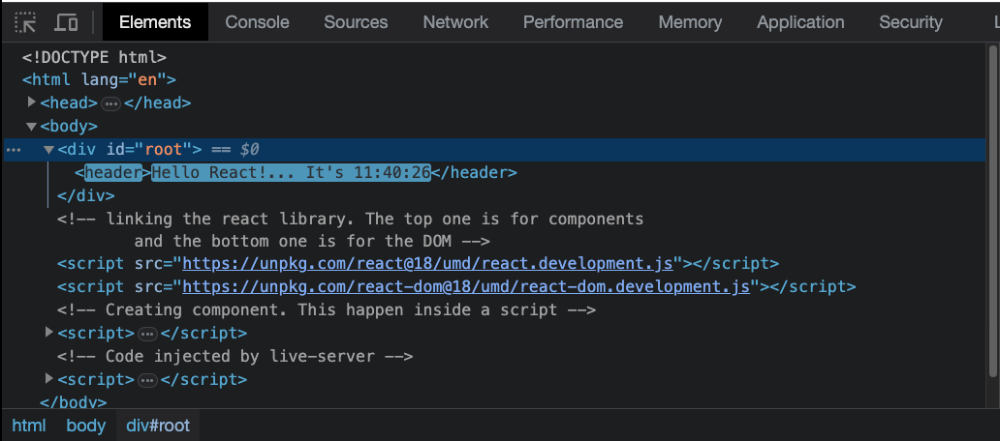

# React.js

React is a JavaScript framework/library that boost developmen productivity x2. It all about component (resuable) that can be used in different projects. Now this repository is all about my React development journey. Wish me luck 💪🏽💯.

---

| Projects 👫 | Difficulty Level 📊 | Progress 📈 |
| :---------: | :-----------------: | :---------: |
|    ....     |        ....         |    ....     |
|             |                     |             |

---

### So what is React❓:

React is **component based**, meaning is all about putting a collection components (like a pricing card, navigation, carousel etc.) together to form a complex user interface. It's putting a puzzle together to reveal the whole picture. Components are reusable. React is **declarative.** This means we tell React what to do. This is possible using JXS. JSX combines HTML, CSS, JavaScript. Since react update the UI keeping in sync with the data, react is **State-driven** (data). React is actually just a library not a framework. React as a "framework" is very popular amongst developers. Big company use react in their web applications, followed by smaller or start up company. It has a vibrant and densed community. Plus, it is created by Facebook/Meta to provide more structure to it's code and allow it to scale much better.

#### What I learned today - 05/Sep/2023:

#### Pure React:

Pure React is basically writing React inside a regular HTML file, without a modern tooling or any build step. For that to happen, one must link/include the React library as a script.

```html
<script src="https://unpkg.com/react@18/umd/react.>development.js"></script>
<script src="https://unpkg.com/react-dom@18/umd/react-dom.development.js"></script>
```

The code below is an example of a so called Pure React:

```js
    <script>
      function App() {
        // const time = new Date().toLocaleTimeString();
        const [time, setTime] = React.useState(new Date().toLocaleTimeString());
        React.useEffect(function () {
          setInterval(() => {
            setTime(new Date().toLocaleTimeString());
          }, 1000);
        }, []);
        return React.createElement(
          "header",    // the element type
          null,    //An object containing properties to be applied on the element - in this case there is no property so 'null' is passed.
          `Hello World!... The time is: ${time}`    // the content of the element. Also reffered to as children
        );
      }
      const root = ReactDOM.createRoot(document.getElementById("root"));
      root.render(React.createElement(App));
    </script>
```

The above codebase created a `header` component with the `React.createElement` that has a string _hello world..._ and **time** state(variable) that is updates every second using `React.useEffect` and the JS setInterval(). This all then render by the DOM.


